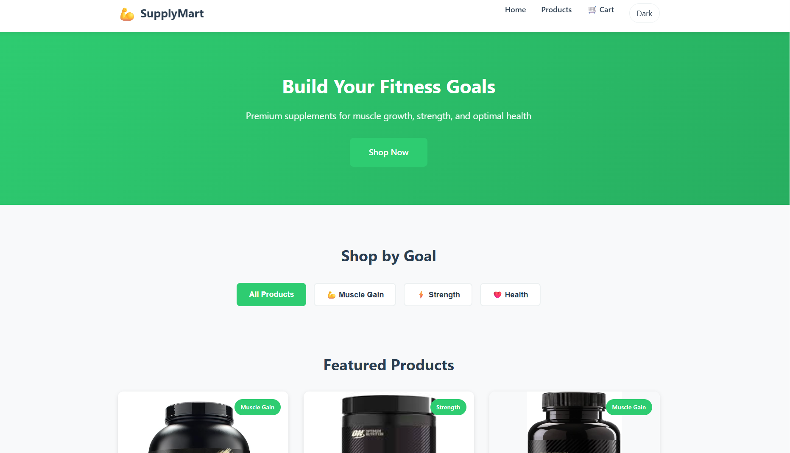
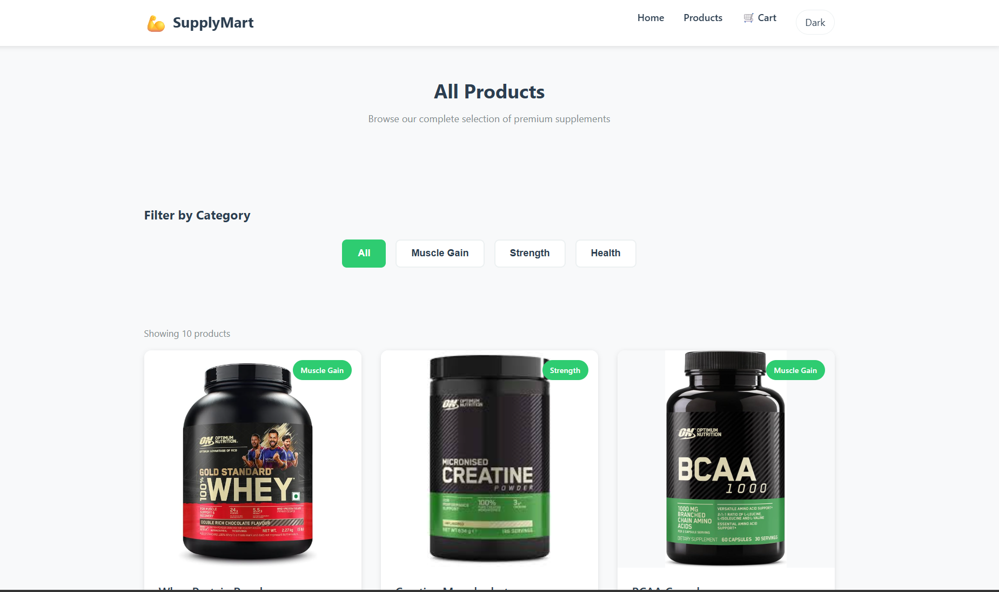
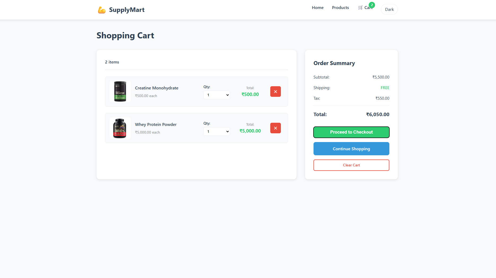

# SupplyMart (FitFuel)

A responsive React e-commerce frontend for fitness supplements. Browse products, filter by category, add items to the cart, and view an order summary — with **₹ INR currency formatting** and a **Light/Dark mode toggle**.

## Features

- Product catalog + category filter
- Product cards with local images
- Cart: add/remove/update quantity
- Order summary: subtotal + tax + total
- **₹ INR currency formatting** (via `Intl.NumberFormat`)
- **Theme toggle** (Dark/Light) with `localStorage` persistence
- Fully responsive layout (mobile → desktop)

## Tech Stack

- React
- React Router
- Context API (cart state)
- Vanilla CSS (single `global.css` with CSS variables)

## Getting Started

### Install

```bash
npm install
```

### Run locally

```bash
npm start
```

Open: http://localhost:3000

## Scripts

- `npm start` — run dev server
- `npm test` — run tests (watch mode)
- `npm run build` — production build

## Project Structure

```text
src/
  components/      # Navbar, ProductCard, CartItem
  pages/           # Home, Products, Cart
  context/         # CartContext (global cart state)
  data/            # products.js (static products)
  assets/          # local product images
  styles/          # global.css
  utils.js         # formatINR()
```

## Currency (₹ INR)

All prices are displayed using a shared formatter:

- `src/utils.js` → `formatINR(value)`

To change currency/locale later, update the formatter configuration in `src/utils.js`.

## Theme Toggle (Dark/Light)

- The theme is stored in `localStorage` (`theme = dark | light`)
- Applied by setting `data-theme` on the `<html>` element
- CSS variables swap automatically in `src/styles/global.css`

## Adding Product Images (Local)

Recommended approach:

1. Put images in `src/assets/`
2. Import them in `src/data/products.js`
3. Set `image: importedImage`

Example:

```js
import wheyImg from "../assets/protein.jpg";

export const products = [
  {
    id: 1,
    name: "Whey Protein Powder",
    price: 5000,
    image: wheyImg,
  },
];
```

## Screenshots

### Home


### Products


### Cart


## License

